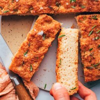

<!--
  RECIPE BINDER TEMPLATE (v2)
  Reuse this exact section order/structure for every future recipe:
    1. H1 Title
    2. Italic one-line tagline
    3. Quick Info line (Servings | Prep | Cook | Total)
    4. "About This Recipe" — short original-words headnote, 2-4 sentences max
    5. Photo — , or an HTML comment placeholder
       (<!-- Add photo: ./Recipe-Name.jpg -->) if no image is available yet
    6. "Ingredients" — grouped under bolded sub-headers when a recipe has components (base, toppings, sauce, etc.)
    7. "Directions" — numbered steps
    8. "Notes & Tips" — substitutions, make-ahead, storage
    9. "Source" — where the recipe was adapted from, if applicable
  Dietary standard (clean eating, oil substitutions) lives once in 00-Dietary-Standard.md at
  the front of the binder — do not repeat it per recipe.
-->

# Gluten-Free Focaccia Bread

*Gluten-free option. A crusty-outside, tender-inside focaccia baked in a cast iron skillet — no one will guess it's gluten-free.*

**Servings:** Not specified in original | **Prep Time:** ~15 min active, plus rising | **Cook Time:** 55–65 min | **Total Time:** ~3 hours including rises and cooling

## About This Recipe

Built on a psyllium-husk-thickened gluten-free dough rather than a standard 1:1 flour blend — the psyllium is what gives it the chew and structure a wheat focaccia would normally get from gluten. Two rises, a skillet bake, and the classic dimpled, rosemary-and-salt top.

## Ingredients

- 1 1/2 cups warm water (100–110°F)
- 1 tablespoon cane sugar
- 1 packet active dry yeast
- 1 cup sorghum or oat flour
- 1 cup potato starch
- 1/3 cup brown rice flour
- 1/3 cup almond flour
- 2 tablespoons whole psyllium husk
- 1 1/2 teaspoons sea salt
- 1/3 cup plain yogurt
- 4 tablespoons olive oil, divided
- Fresh rosemary, for topping
- Coarse or flaky sea salt, for topping

## Directions

1. In a medium bowl, whisk together the warm water and sugar until the sugar dissolves. Whisk in the yeast and let it bloom on the counter for 10 minutes, until frothy. (If it doesn't foam, start over — the water may have been too hot, or the yeast expired.)
2. Meanwhile, in a large bowl, whisk together the sorghum or oat flour, potato starch, brown rice flour, almond flour, psyllium husk, and salt. Set aside.
3. Once the yeast has bloomed, whisk the yogurt and 2 tablespoons of the olive oil into the wet mixture. Make a well in the center of the dry ingredients and pour the wet mixture into the well. Mix immediately with a wooden spoon. The batter starts loose and liquidy, almost like pancake batter — it will thicken considerably as the psyllium husk absorbs the water.
4. Once the mixture has thickened and has no lumps, cover with a thin kitchen towel and let rise at room temperature for 1 hour.
5. Coat the bottom of a 10-inch cast iron skillet completely with olive oil. Transfer the dough into the skillet and spread it evenly.
6. Drizzle the top with olive oil and spread it with clean hands, then press your fingertips into the surface to dimple it all over.
7. Top with fresh rosemary and coarse sea salt. Let rise for another 15–20 minutes while preheating the oven to 425°F.
8. Bake for 55–65 minutes, until the top is golden and the center feels springy when pressed.
9. Let cool for at least 1 hour before slicing.

## Notes & Tips

- Best fresh. Leftovers keep 1–2 days at room temperature, 1 week refrigerated, or 1 month frozen. Reheat leftovers sliced and toasted for the best texture.

## Source

Adapted from a personal recipe collection.
