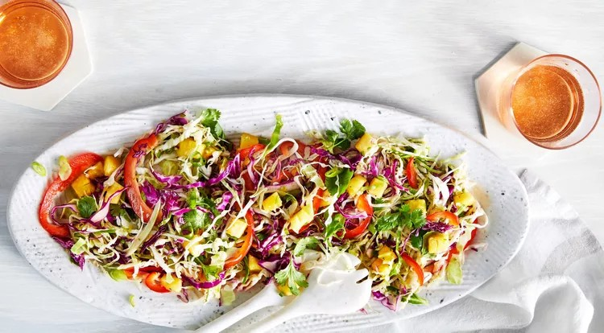

<!--
  RECIPE BINDER TEMPLATE (v2)
  Reuse this exact section order/structure for every future recipe:
    1. H1 Title
    2. Italic one-line tagline
    3. Quick Info line (Servings | Prep | Cook | Total)
    4. "About This Recipe" — short original-words headnote, 2-4 sentences max
    5. Photo — , or an HTML comment placeholder
    6. "Ingredients" — grouped under bolded sub-headers when a recipe has components (base, toppings, sauce, etc.)
    7. "Directions" — numbered steps
    8. "Notes & Tips" — substitutions, make-ahead, storage
    9. "Source" — where the recipe was adapted from, if applicable
  Dietary standard (clean eating, oil substitutions) lives once in 00-Dietary-Standard.md at
  the front of the binder — do not repeat it per recipe.
-->

# Pineapple-Pepper Slaw

*A bright, crunchy cabbage and pineapple slaw with jalapeño heat and a honey-lime vinaigrette.*

**Servings:** Not specified in original | **Prep Time:** ~20 min, plus 10 min rest | **Cook Time:** None

## About This Recipe

Sweet pineapple and jalapeño heat play off each other over a base of green and red cabbage, with cilantro and scallions for freshness. A good match for grilled burgers or fried chicken.

## Ingredients

- 4 cups shredded green cabbage
- 2 cups shredded red cabbage
- 2 cups cubed fresh pineapple
- 1 red bell pepper, thinly sliced
- 1/2 cup fresh cilantro leaves
- 1/2 cup thinly sliced scallions
- 2 tablespoons minced, seeded jalapeño
- 1 teaspoon lime zest, plus 2 tablespoons lime juice
- 1 teaspoon honey
- 1 teaspoon kosher salt
- 1/4 teaspoon black pepper
- 1/3 cup extra-virgin olive oil

## Directions

1. Toss together the green cabbage, red cabbage, pineapple, bell pepper, cilantro, scallions, and jalapeño in a large bowl.
2. Whisk together the lime zest, lime juice, honey, salt, and pepper in a small bowl. Add the oil in a slow, steady stream, whisking constantly until smooth.
3. Add the vinaigrette to the cabbage mixture and toss to coat. Let stand 10 minutes, toss again, and serve.

## Notes & Tips

- Use both green and red cabbage for the best color and flavor contrast; a mandoline or sharp knife makes quick work of shredding, or use pre-shredded bagged cabbage.
- The vinaigrette is worth doubling — it holds well in a sealed jar in the fridge and works over grilled vegetables, fish, or chicken. Shake well before using.

## Source

Adapted from a personal recipe collection.
