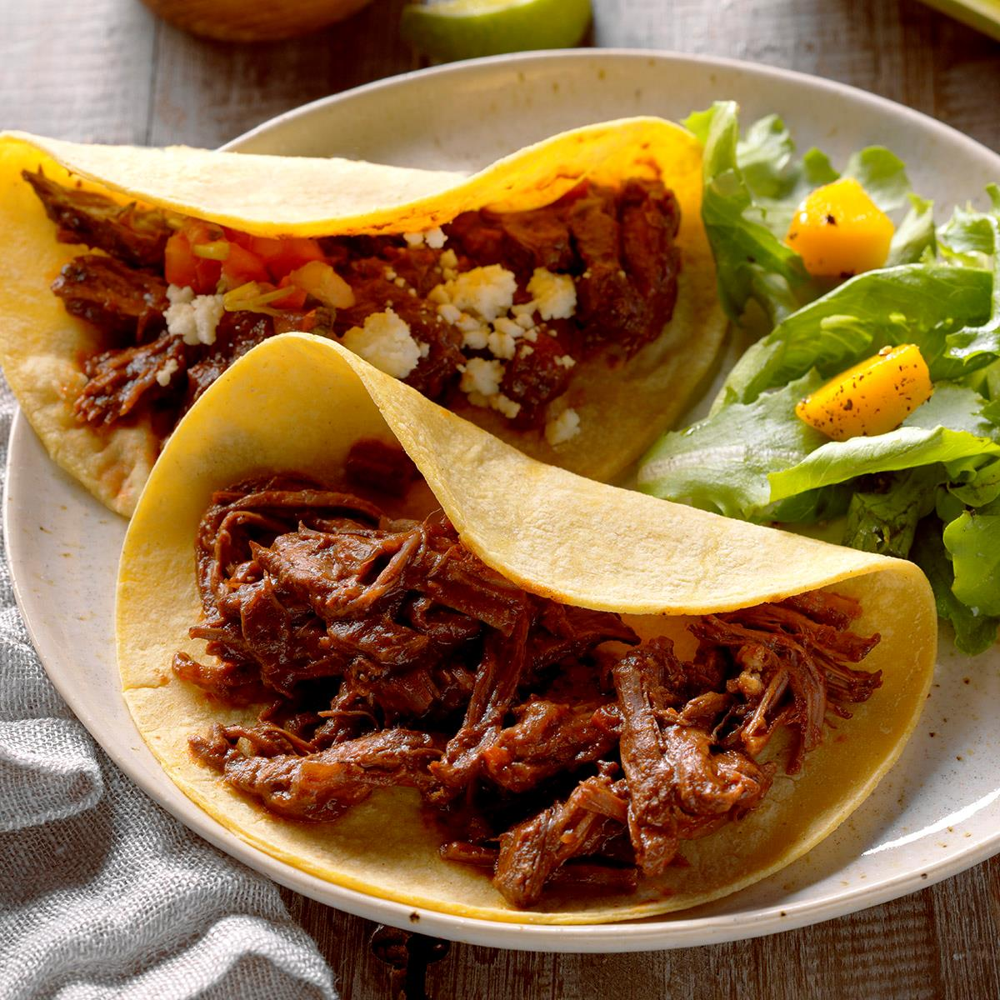

<!--
  RECIPE BINDER TEMPLATE (v2)
  Reuse this exact section order/structure for every future recipe:
    1. H1 Title
    2. Italic one-line tagline
    3. Quick Info line (Servings | Prep | Cook | Total)
    4. "About This Recipe" — short original-words headnote, 2-4 sentences max
    5. Photo — , or an HTML comment placeholder
       (<!-- Add photo: ./Recipe-Name.jpg -->) if no image is available yet
    6. "Ingredients" — grouped under bolded sub-headers when a recipe has components (base, toppings, sauce, etc.)
    7. "Directions" — numbered steps
    8. "Notes & Tips" — substitutions, make-ahead, storage
    9. "Source" — where the recipe was adapted from, if applicable
  Dietary standard (clean eating, oil substitutions) lives once in 00-Dietary-Standard.md at
  the front of the binder — do not repeat it per recipe.
-->

# Short Rib Tacos

*Braised bone-in short ribs in a cocoa-tomato-beer braise, shredded and served on tortillas with pico de gallo.*

**Servings:** 6 | **Prep Time:** 40 min | **Cook Time:** 2 1/2 hours

## About This Recipe

A Dutch-oven braise that builds a mole-adjacent depth of flavor from toasted cocoa and dark beer, then finishes as shredded short rib tacos with fresh pico de gallo and queso fresco.

## Ingredients

- 2 tablespoons avocado oil
- 6 bone-in beef short ribs
- 1/4 teaspoon salt
- 1/4 teaspoon pepper
- 2 medium carrots, finely chopped
- 1 small yellow onion, finely chopped
- 2 tablespoons baking cocoa
- 1 can (15 oz) tomato sauce
- 1 bottle (12 oz) dark beer or beef broth
- Water, optional
- 12 corn tortillas (6-inch), warmed
- 3/4 cup pico de gallo
- 3/4 cup queso fresco or crumbled feta cheese

## Directions

1. Preheat the oven to 325°F. Heat the oil in an ovenproof Dutch oven over medium-high heat. Season the beef with salt and pepper and brown in batches. Remove with tongs.
2. Reduce the heat to medium. Add the carrots and onion to the drippings; cook, stirring frequently, until starting to brown, 3–5 minutes.
3. Add the cocoa and toast, stirring frequently, until aromatic, 1–2 minutes.
4. Add the tomato sauce and beer, stirring to loosen the browned bits from the pan. Bring to a boil and simmer 2–3 minutes.
5. Return the ribs to the pan; add water if needed to cover. Bake, covered, until the meat is tender, 2 1/2 to 3 hours.
6. Remove from the oven and drain, reserving the juices. Once cool enough to handle, remove the meat from the bones and discard the bones. Shred the meat with two forks. Skim the fat from the reserved juices.
7. Return the meat and juices to the Dutch oven and heat through. Serve on tortillas with pico de gallo and queso fresco (or cotija).

## Notes & Tips

- The original recipe called for canola oil; swapped for avocado oil here per the binder standard.

## Source

Adapted from a personal recipe collection.
